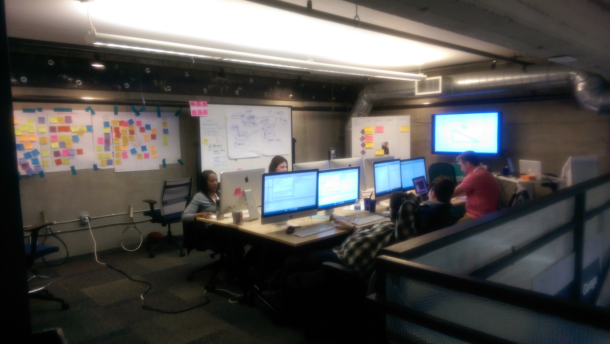

# Facilities

####We require the following facilities to ensure a successful workshop experience (see figure 1):

* [Large Format Display](https://www.cdw.com/shop/search/hubs/Monitors-Projectors/Large-Format-Displays/d8.aspx)
* Instructor’s Podium
* White Boards
* Dry Erase Markers
* Flip Charts and Stands
* [Post-It Easel Pads](http://www.post-it.com/3M/en_US/post-it/products/~/Post-it-Products/Easel-Pads/?N=4327+5927574+3294529207+3294857497&rt=r3)
* Post-It Stickies (3 x 3 and 3 x 5; multiple colors)
* 3 x 5 Index Cards
* [Sticky Dots](https://www.amazon.co.uk/COLOURED-CIRCLES-ADHESIVE-ASSORTED-COLOURS/dp/B007HOSZEU) (multiple colors)
* [Labeling Tape](https://www.walmart.com/ip/Dymo-Corporation-Glossy-Self-Adhesive-Labeling-Tape-for-Embossers-3-8in-x-144ft-Roll-Red/21424916) (multiple colors)
* Ample Wall Space for Group Activities
* Ample Table Surface Area for Group Activities
* Ergonomic Office Chairs
* [Flip-Top Tables on Wheels](http://www.smartdesks.com/flip-top-training-conference-table-nesta-laptop-tables.asp) (1 for each participant pair)

  <b>figure 1</b>

## License

Copyright © 2017 IBM Corproation (all rights reserved)

## License

Copyright © 2017 IBM Corproation (all rights reserved)

